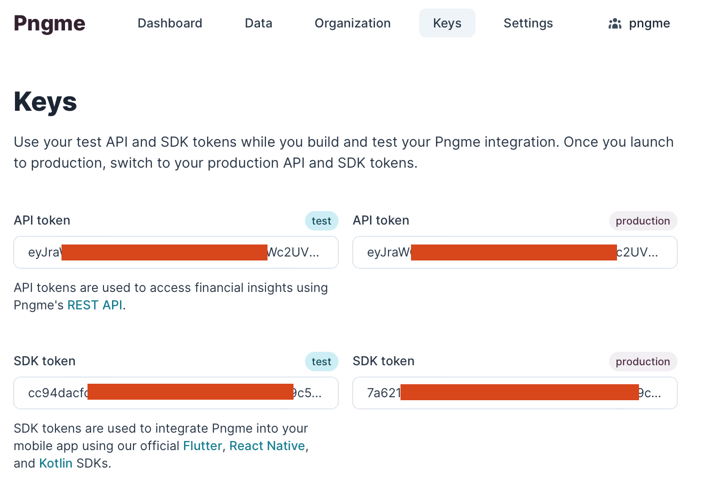

# Pngme Android (Flutter) integration & Sample App

*Welcome to the Pngme v2.x Flutter Integration!*<br>
This Readme will cover how to use the Kotlin SDK v2.x with Flutter, 
including get-started basics, and a sample Android app.

### Legacy SDK
[Contact Pngme](mailto:support@pngme.com) for a copy of documentation on the legacy SDK (v1.0.34).

### Kotlin
For the v2.x *Kotlin* docs and sample app, visit [here](https://github.com/pngme/sample-android-app-kotlin).

### React Native
For the v2.x *React Native* docs app,visit [here](https://github.com/pngme/sample-android-app-react-native).

## How it works
Pngme does not currently provide a native Flutter (Dart) package for the Pngme SDK.
Instead, this repo includes instructions for how to configure your `/android` directory 
so the Kotlin SDK is callable from your Flutter app.

These steps include:
- adding a Kotlin Activity class (`PngmeSDKHelper.kt`) that wraps the Pngme SDK
- modify the Kotlin `MainActivity.kt` to add a [channel](https://docs.flutter.dev/development/platform-integration/platform-channels)
  that can be accessed from the main Flutter app, and used to manage the above-mentioned Activity.

See the [Get Started](#get-started) section for step-by-step instructions.

## v2.x SDK - the basics
1. The SDK accomplishes three tasks:
    - register a mobile phone user with pngme's identity system
    - request permission for SMS from the user, with a [Permission Dialog Flow](.docs/permission_flow.gif)
    - periodically send SMS data to pngme's data processing pipeline
2. The SDK supports Android API level 16+
3. The SDK exposes three methods: a main entrypoint method, and two helper methods
4. Using the SDK requires an **SDK Token**
   * To retrieve your **SDK Token**, sign up and **get started _for free_** at the [Pngme admin webconsole](https://admin.pngme.com)
   * Once you have created your organization, navigate to `Keys` in the webconsole and copy the SDK Token for the environment you want to use

 

When the SDK has been successfully integrated, financial data extracted from a user's SMS will be accessible
in the [Pngme admin Webconsole](https://admin.pngme.com) or
via the Pngme REST APIs
(see the [API Reference docs](https://developers.api.pngme.com/reference/getting-started-with-your-api)).

> This SDK Token will be passed as the `clientKey` parameter to the Pngme SDK in your app code.

## Get Started
To set up your project to use the Pngme SDK, follow these setup steps.

## Setup
This sample app assumes you have Android Studio installed,
and your local environment is configured for Flutter development as per [official documentation](https://docs.flutter.dev/get-started/install).

### _Step 1_
Resolve the JitPack package manager in your Gradle file.
Add the following to `/android/build.gradle`.
```groovy
    allprojects {
        repositories {
            maven { url 'https://jitpack.io' }
        }
    }
```

### _Step 2_
In the same `/android/build.gradle` file, 
update `ext.kotlin_version` to `'1.4.32'` if you are using an older version.
If you are using a newer version please ignore this step.
```groovy
buildscript {
    ext.kotlin_version = '1.4.32' // <-- update version here
    repositories {
        google()
        jcenter()
    }
```

### _Step 3_
Add the following dependencies to `android/app/build.gradle`.
This includes the `v2.0.4` version of the Pngme Android Native Kotlin SDK.
```groovy
dependencies {
    implementation "org.jetbrains.kotlin:kotlin-stdlib-jdk7:$kotlin_version"
    // Add from here
    implementation ('com.github.pngme:android-sdk:v2.0.4')
    implementation 'androidx.appcompat:appcompat:1.2.0'
    implementation("androidx.multidex:multidex:2.0.1")
    // to here
}
```

### _Step 4_
In the same `android/app/build.gradle` file, add the following to the `android` section:
```groovy
android {
    defaultConfig {
        multiDexEnabled = true  
    }
}
```

### _Step 5_
Create the Pngme SDK wrapper.
Copy the following file from this repo into your project:
`/android/app/src/main/kotlin/com/example/sampleflutter/PngmeSDKHelper.kt`

⚠️ *Modify the top line of the `PngmeSDKHelper.kt` file to match your project path/naming.*
```groovy
package com.example.sampleflutter
```
⬆️ _change this!_

### _Step 6_
Add the PngmeSDKHelper as an activity in your manifest `/android/app/src/main/AndroidManifest.xml`:
```xml
<activity android:name="com.example.sampleflutter.PngmeSDKHelper" android:theme="@style/Theme.AppCompat.NoActionBar" />
```
⚠️ *As above, change `com.example.sampleflutter` to match your project path/naming.*

### _Step 6_
Add the Flutter channel to your main activity `/android/app/src/main/kotlin/com/<my>/<app>/MainActivity.kt`.
Modify the `MainActivity.kt` to match that included in this sample app.
Specifically, copy this override to the MainActivity class: `override fun configureFlutterEngine(...) {...}`

### _Step 7_
Call the Pngme SDK via the Flutter channel from your main flutter app, passing the `go` method in the channel.
```dart
value = await sdkChannel.invokeMethod("go", <String, dynamic>{
        'sdkToken': 'XXXXXXX',
        'firstName': 'Nico',
        'lastName': 'Rico',
        'email': 'nicorico@pngme.com',
        'phoneNumber': '2348118445990',
        'externalId': '',
        'isKycVerified': false,
        'companyName': 'AcmeInc'
      });
```

## Sample Android App
This repository is a sample Android app, which uses the Pngme Kotlin SDK with the custom files referenced in the [Get Started](#get-started) section.

The Pngme SDK is launched in the `openSDK()` method located in the Flutter app entrypoint: `lib/main.dart`.
This method simply calls the `PngmeSDKHelper.kt` class set up in the [Get Started](#get-started) section, using a Flutter channel:
```dart
String value;
value = await sdkChannel.invokeMethod("go", <String, dynamic>{
        'sdkToken': 'XXXXXXX',
        'firstName': 'Nico',
        'lastName': 'Rico',
        'email': 'nicorico@pngme.com',
        'phoneNumber': '2348118445990',
        'externalId': '',
        'isKycVerified': false,
        'companyName': 'AcmeInc'
      });
```

> ⚠️ The SDK Token is sensitive and must be protected.
>
> It should be passed to the application at compile time, and encrypted.
The SDK Token as a magic string in the sample app is **for demonstration purposes only**.

### Behavior
The sample app includes a button that can be pressed once.
When the button is pressed, the SDK is invoked, creating a user in Pngme's system specified by the params passed in the `openSDK()` method in `main.dart`.
_The SMS [Permission Flow](.docs/permission_flow.gif) is shown to the user the first time, and only the first time, that the SDK is invoked_.
If SMS permissions are granted by the user, and SMS are present on the phone, 
then the SMS will be back-hauled to Pngme's system 
(and continue to be back-hauled periodically by the background Android worker).

## Send SMS data locally
As noted above, the primary responsibility of the Pngme SDK is to send SMS data to the Pngme system.
This can be tested in a sample app running in the local emulator.

> *If a valid SDK token is used in the `'sdkToken': 'XXXXXXX'` parameter, then the below SMS will be successfully sent to the Pngme system*.

The following text message is of a recognized format for the Stanbic bank sender: `Stanbic`.
```text
Acc:XXXXXX1111
CR:NGN4,000.00
Desc:HELLO WORLD! SAMPLE MESSAGE
Bal:NGN50,000.00
```

You can inject this fake SMS into the emulated phone by following these steps.
It is advisable that you pre-populate the emulated phone with the SMS _before_ running the sample app.


1. Open the `more` window in the emulator settings
2. Navigate to the `phone` section
3. Set the sender to the string `Stanbic`
4. Copy/Paste the above same message into the message box
5. Hit `Send Message`

After following the above steps to send a fake SMS, run the sample app.
The fake SMS will be sent to the Pngme system using the SDK token from your Pngme account.
If the sample app runs successfully, the financial data in the text message will be accessible
via the [Pngme REST APIs](https://developers.api.pngme.com/reference/getting-started-with-your-api) or in the [Pngme webconsole](https://admin.pngme.com).

## Publishing to the Google Store
So you have a working app! Congrats! But... it's not over yet.
You will still need to whitelist your app with the Google Play store.  
This is a special step necessary for any apps that require SMS permissions from the user.

The whitelisting process is not hard, but if you have never whitelisted an app before, you may want assistance.
Pngme can offer support in whitelisting your app, free of charge.
Simply [contact us](mailto:whitelisting@pngme.com)
and also visit our guide: [Going Live](https://developers.api.pngme.com/docs/going-live-with-the-sdk).
We'll help you get your app through the approval process faster than you can say `Hello World!`

If you insist on whitelisting your app without Pngme's assistance,
please let us know and we will provide you with instructions.
These will help you avoid setbacks when submitting your app for review.